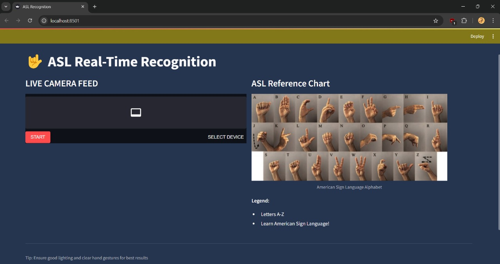
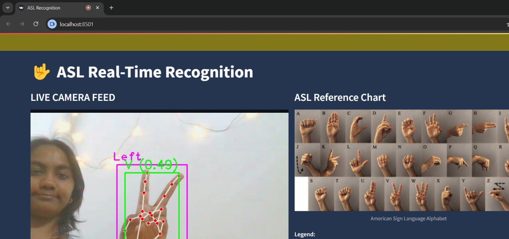
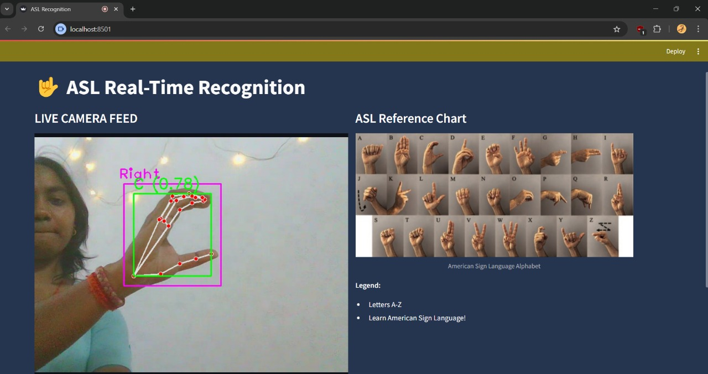
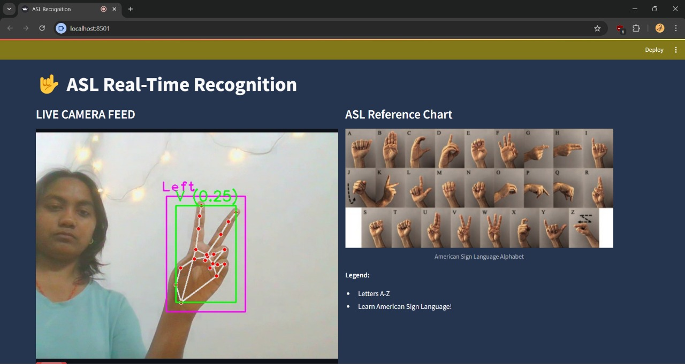

---

# 🤟 ASL Sign Language Detection + Crossword Game using MobileNetV2

This project focuses on detecting American Sign Language (ASL) hand gestures using deep learning and taking it a step further — using those detected signs to play a simple **crossword game**. The system includes data collection with OpenCV and MediaPipe, training a MobileNetV2-based image classification model, and evaluating its performance on a custom dataset of ASL signs (0-9 and A-Z).

By integrating ASL recognition with an interactive crossword puzzle, we aim to make language learning more engaging, intuitive, and enjoyable. Such playful learning experiences can significantly contribute to the cognitive and linguistic development of young users — turning sign language practice into a fun and educational game.

---

## 🛠️ Installation

```bash
git clone https://github.com/therealsheero/ASL-Detection-Crossword
cd ASL-Detection-Crossword
```

📦 Requirements
Install the required packages using:

```bash
pip install -r requirements.txt
```

---

## 🖐️ Data Collection

```bash
python Collect_Data.py 
```

**Controls**:

* `S` - Save frame
* `Q` - Quit
* Auto-cropping to hand region

---

## 🧠 Model Training

```bash
python train_pth.ipynb 
  --data_dir data 
  --model mobilenetv2 
  --epochs 20 
  --output asl_mobilenetv2_best.pth
```

**Training Results**:

```
Epoch 20/20 | Epoch 20: Train Acc: 1.0000, Val Acc: 0.9722
Test Accuracy: 98.3%
```

---

## ▶️ Real-Time Detection

```bash
python test.py 
```


---

## 🎮 ASL-Powered Crossword Game

```bash
python app2.py 
```
```bash
streamlit run app2.py
```

**How it works**:

* Detects ASL signs in real-time using your webcam
* Uses the detected sign to fill crossword puzzles
* Fun way to test your ASL knowledge while playing!

This game helps users reinforce their learning through interaction — as each correct sign detected fills in a crossword slot, encouraging continuous practice.

---

## 📊 Performance

| Metric   | Value |
| -------- | ----- |
| Accuracy | 98.3% |

---

## 🌟 Key Files

* `Collect_Data.py`: Hand tracking + data saver
* `train_pth.ipynb`: Model training pipeline
* `test.py`: Live webcam detection
* `app2.py`: **ASL Crossword Game Application**

---

## ▶️ How to Use

* Collect your own ASL dataset using `Collect_Data.py`
* Train the model with `train_pth.ipynb`
* Test real-time ASL detection with `test.py`
* Play the ASL-powered crossword game using `app2.py`

This model can be integrated into a real-time webcam-based ASL interpreter using OpenCV and MediaPipe or cvzone. Load the model, capture the hand ROI, preprocess it, and run predictions — now also connected to the crossword game for interactive learning!

---

## Demo Images









---

## 🚀 Future Work

* Add multiplayer crossword challenges
* Improve dataset diversity with more hand shapes and lighting conditions
* Deploy the ASL + Crossword game on web or mobile
* Add competitive crossword, adding solution and answers, reward based gamification!
 
---

## 📧 Contact

[2004divyanshii@gmail.com](mailto:2004divyanshii@gmail.com)

---

